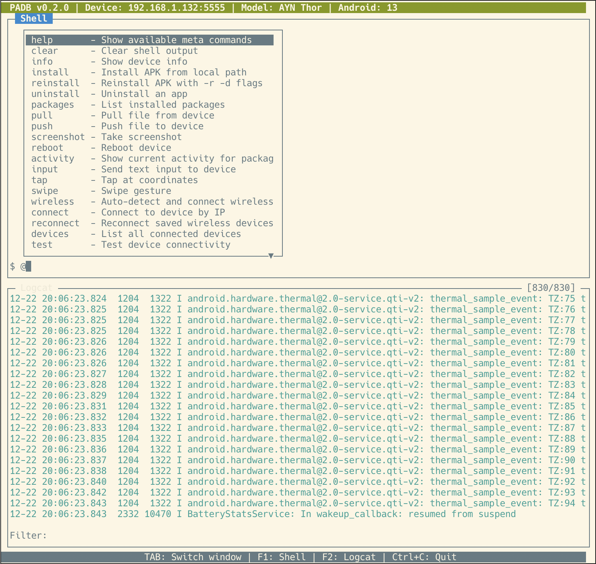

# PADB - Python ADB TUI



A terminal user interface for Android Debug Bridge operations built with Python and curses.

## Features

- **Device Management**: Auto-detect and connect to Android devices, auto-reconnect polling when no device connected
- **Wireless Pairing (Android 11+)**: Pair and connect wirelessly without USB using `adb pair` — accessible from the waiting screen (press P) or via `@pair` command
- **Wireless Debugging (Legacy)**: Auto-detect USB devices and enable wireless mode via `adb tcpip`, with persistent IP storage and auto-reconnect
- **Interactive Shell**: Execute ADB shell commands with command history (UP/DOWN keys)
- **Meta Commands**: Built-in commands for install, pull, push, screenshot, and more
- **Live Logcat**: Real-time log streaming with regex filtering
- **Color-coded Logs**: Visual distinction between error, warning, info, and debug messages

## Prerequisites

- Python 3.11 or higher
- ADB installed and in your PATH
- Android device with USB debugging enabled

## Installation

1. Clone the repository:
```bash
git clone <repository-url>
cd padb
```

2. Install dependencies:
```bash
pip3 install -r requirements.txt
```

3. Ensure ADB server is running:
```bash
adb start-server
```

## Usage

### Starting the Application

```bash
python3 main.py
```

### Device Selection

On startup:
- If one device is connected, it auto-connects
- If multiple devices are connected, use UP/DOWN arrows to select and ENTER to connect
- If no device is connected, the waiting screen appears — press **P** to pair wirelessly (Android 11+)

### Window Navigation

| Key | Action |
|-----|--------|
| TAB | Switch between Shell and Logcat windows |
| F1 | Focus Shell window |
| F2 | Focus Logcat window |
| Ctrl+C | Quit application |

### Shell Window

The top window provides an interactive shell for executing commands on the device.

| Key | Action |
|-----|--------|
| ENTER | Execute command |
| UP/DOWN | Navigate command history |
| Page Up/Down | Scroll output |
| Left/Right | Move cursor |
| Home/End | Jump to start/end of line |

**Example shell commands:**
```
ls /sdcard
pm list packages
dumpsys battery
getprop ro.build.version.release
```

**Meta Commands:**

The shell supports special meta commands prefixed with `@`:

| Command | Description |
|---------|-------------|
| `@help` | Show all available meta commands |
| `@clear` | Clear shell output |
| `@info` | Show device information |
| `@install <path>` | Install APK from local path |
| `@uninstall <package>` | Uninstall an app |
| `@packages [filter]` | List installed packages (optional filter) |
| `@pull <remote> [local]` | Pull file from device |
| `@push <local> <remote>` | Push file to device |
| `@screenshot [filename]` | Take screenshot (auto-named if no filename) |
| `@reboot [mode]` | Reboot device (modes: bootloader, recovery) |
| `@activity <package>` | Show current activity for package |
| `@input <text>` | Send text input to device |
| `@tap <x> <y>` | Tap at screen coordinates |
| `@swipe <x1> <y1> <x2> <y2>` | Swipe gesture |
| **Wireless** | |
| `@pair <ip:port> <code>` | Pair with device (Android 11+ wireless debugging) |
| `@wireless` | Auto-detect USB devices and enable wireless mode |
| `@connect <ip[:port]>` | Connect to device by IP |
| `@disconnect <ip>` | Disconnect from wireless device |
| `@reconnect` | Reconnect to saved wireless devices |
| `@devices` | List all connected devices |
| `@test` | Test device connectivity |
| `@server restart` | Restart ADB server |
| `@saved` | View saved wireless IPs |
| `@forget <ip>` | Remove IP from saved list |

**Examples:**
```
@install ~/Downloads/myapp.apk
@packages google
@screenshot
@pull /sdcard/Download/file.txt ./
@tap 500 800
@pair 192.168.1.5:37123 123456
@connect 192.168.1.5:41567
@wireless
```

### Logcat Window

The bottom window streams device logs in real-time.

| Key | Action |
|-----|--------|
| / | Enter filter mode |
| ESC | Exit filter mode |
| ENTER | Apply filter |
| C | Clear all logs |
| Page Up/Down | Scroll (disables auto-scroll) |
| End | Resume auto-scroll |

**Filtering:**
Press `/` to enter filter mode, then type a regex pattern:
- `error` - Show lines containing "error" (case-insensitive)
- `MyApp` - Show logs from your app
- `E/.*MyTag` - Show errors with specific tag

**Log Level Colors:**
- Red: Errors (E)
- Yellow: Warnings (W)
- Cyan: Info (I)
- Green: Debug (D)

## Project Structure

```
padb/
├── main.py              # Entry point
├── requirements.txt     # Dependencies
└── padb/                # Main package
    ├── device.py        # ADB device manager
    ├── wireless.py      # Wireless device state persistence
    └── tui/             # TUI components
        ├── app.py       # Main application
        ├── shell.py     # Shell window
        ├── logcat.py    # Logcat window
        └── status.py    # Status bar
```

## Troubleshooting

### "No devices found"
1. Check USB connection
2. Enable USB debugging on device: Settings > Developer Options > USB Debugging
3. Verify device is visible: `adb devices`
4. Restart ADB server: `adb kill-server && adb start-server`

### ADB server not running
```bash
adb start-server
```

### Permission denied on Linux
Add udev rules for your device or run with sudo (not recommended for production).

## License

MIT License

## Changelog

### v0.4.0

- mDNS device discovery (`adb mdns services`) for automatic wireless reconnection
- Auto-reconnect at startup: tries saved wireless IPs then mDNS discovery before showing waiting screen
- Automatic mDNS discovery during waiting screen polling (every 5s)
- `@discover` meta command for manual mDNS discovery mid-session
- Press D on waiting screen for immediate mDNS discovery with visual feedback

### v0.3.0

- Android 11+ wireless pairing support (`adb pair`) via `@pair` command
- Pairing dialog on the waiting screen (press P) with auto-detected IP prefix
- Connect to paired devices via `@connect` with dynamic port support

### v0.2.0

- Initial release
- Device auto-detection and selection
- Wireless ADB connection support (legacy `adb tcpip` method)
- Interactive shell with command history
- Meta commands support (@install, @pull, @push, @screenshot, etc.)
- Live logcat streaming with regex filtering
- Color-coded log levels
- Auto-reconnect polling when device disconnects
- Persistent wireless IP storage with auto-reconnect
